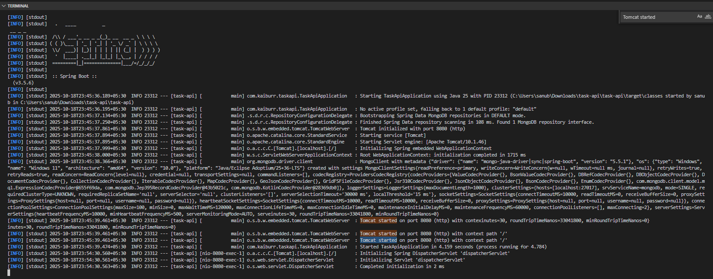
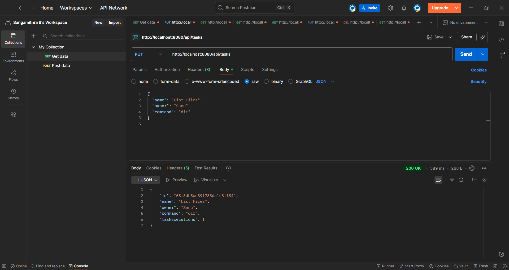
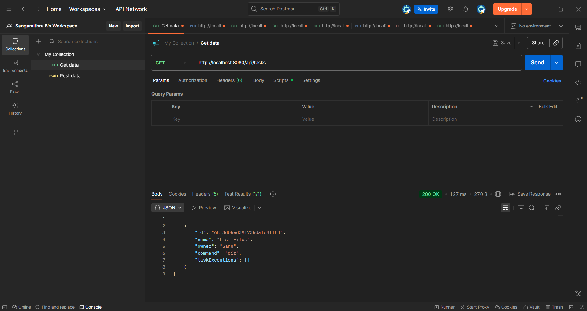
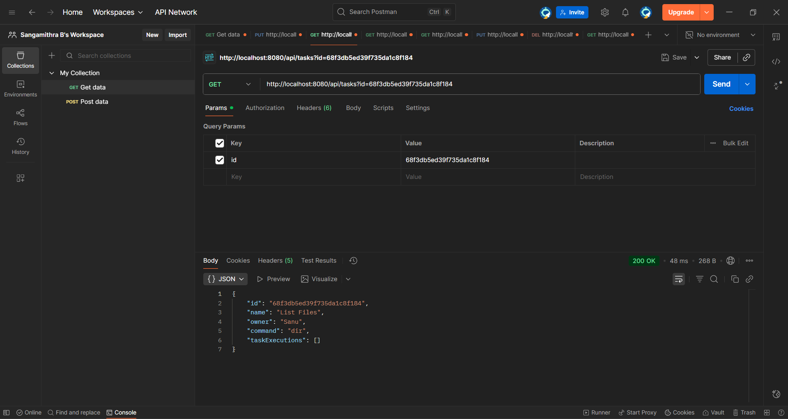
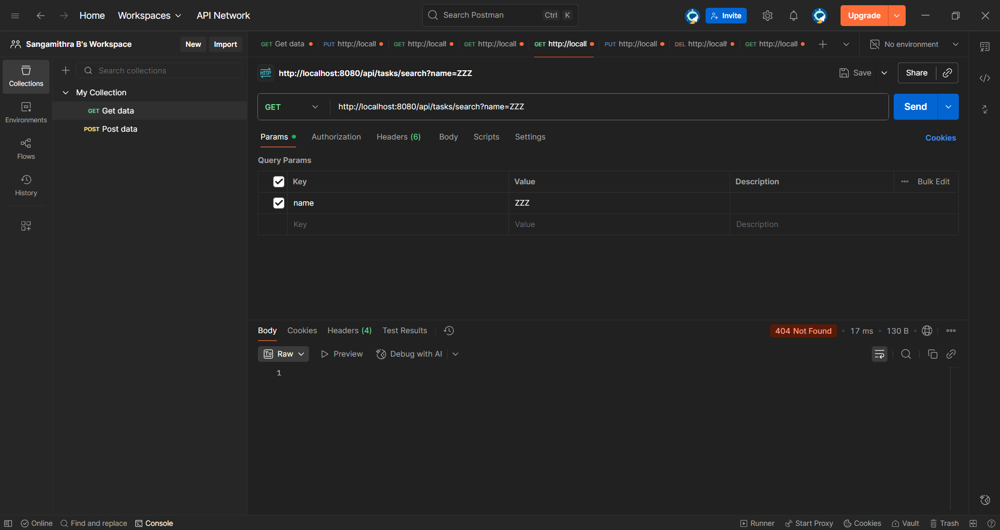
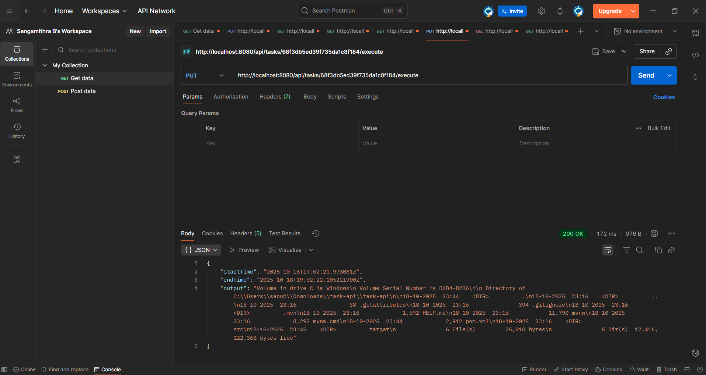
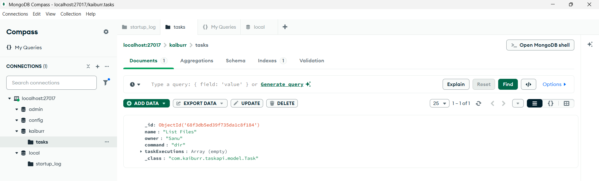
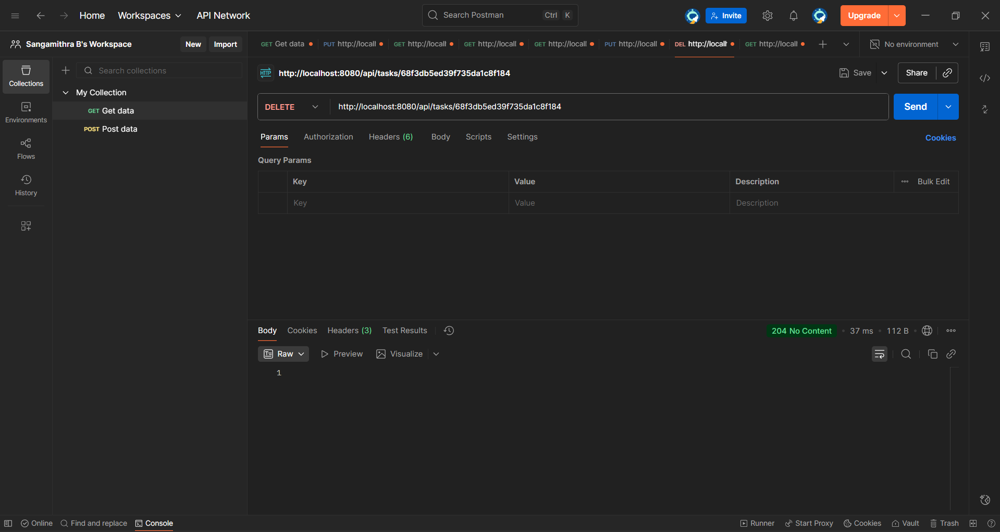
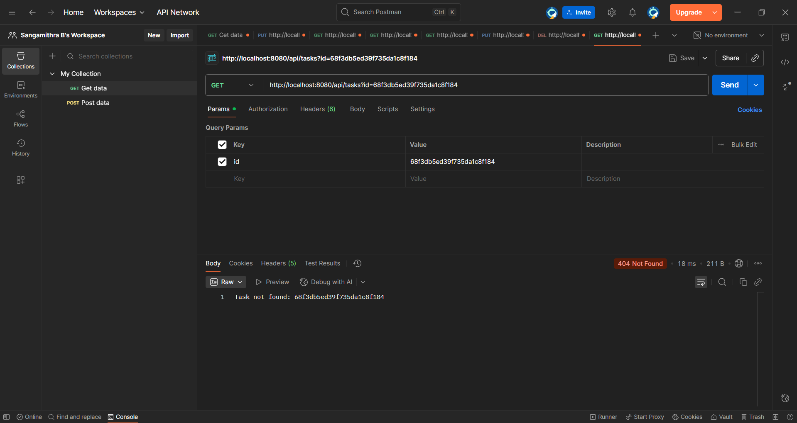

# Kaiburr Task 1 – Spring Boot + MongoDB API

This project is a RESTful API built using **Spring Boot** and **MongoDB** for managing tasks.

## Features
- Create and update tasks  
- Retrieve tasks by ID or name  
- Delete tasks  
- Execute shell commands through a safe runner  

## Tech Stack
- **Java 17**  
- **Spring Boot 3**  
- **MongoDB**  
- **Maven**  
- **Postman** for testing APIs  

## Endpoints
| Method | Endpoint | Description |
|---------|-----------|-------------|
| `PUT` | `/api/tasks` | Create or update a task |
| `GET` | `/api/tasks` | Retrieve all tasks |
| `GET` | `/api/tasks?id=<id>` | Get task by ID |
| `GET` | `/api/tasks?name=<name>` | Get task by name |
| `DELETE` | `/api/tasks?id=<id>` | Delete a task |
| `GET` | `/api/tasks/execute?id=<id>` | Execute command for a task |

## Screenshots

Below are screenshots showing the working API for Kaiburr Task 1:

✅ **Spring Boot Console Log**  


✅ **POST /api/tasks – Create Task**  


✅ **GET /api/tasks – Retrieve All Tasks**  


✅ **GET /api/tasks?id={id} – Retrieve by ID**  


✅ **GET /api/tasks/search?name={name} – Search Success**  


✅ **GET /api/tasks/search?name={name} – 404 Not Found**  


✅ **PUT /api/tasks/{id}/execute – Execute Command**  


✅ **MongoDB Compass – Task Stored with Execution Data**  


✅ **DELETE /api/tasks/{id} – 204 Success**  


✅ **GET /api/tasks/{id} – 404 After Deletion**  



## How to Run
1. Ensure MongoDB is running on **localhost:27017**  
2. Run the app:
   ```bash
   mvn spring-boot:run
## Example Output
```json
{
  "id": "6701d9e4b3d8f25f1c8f184b",
  "name": "List Files",
  "owner": "Sanu",
  "command": "dir"
}
---

🧑‍💻 **Author:** Sangamithra B  
🎓 Final Year B.Tech | Amrita Vishwa Vidyapeetham, Coimbatore  
📅 Completed for Kaiburr Internship Task 1 – October 2025
